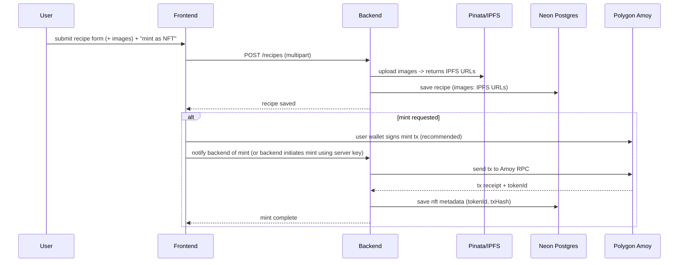

# NFT Recipe Sharing Platform

A full‑stack platform to create, share and optionally mint recipe posts as NFTs.

---

## Quick summary

* **Backend**: Node.js + Express (folder: `backend` / repository root contains backend files like `app.js`, `server.js`, `controllers`, `routes`, `prisma`)
* **Frontend**: React (files: `App.jsx`, `main.jsx`, `components`, `pages`, `services`, etc.)
* **ORM / DB**: Prisma + PostgreSQL hosted on **Neon DB**
* **NFTs**: Pinata (IPFS) for media + **Polygon Amoy** (testnet) for minting
* **Deployment**: Vercel for frontend & backend (serverless) with `vercel.json` present

---

## Table of contents

* [Prerequisites](#prerequisites)
* [Installation](#installation)
* [Environment variables](#environment-variables)
* [Database (Prisma) setup](#database-prisma-setup)
* [Run locally](#run-locally)
* [Architecture](#architecture)

  * [High-level Mermaid diagram](#high-level-mermaid-diagram)
  * [Sequence diagram: create & mint recipe NFT](#sequence-diagram-create--mint-recipe-nft)
* [Prisma schema (recommended)](#prisma-schema-recommended)
* [API overview](#api-overview)
* [Deployment (Vercel)](#deployment-vercel)
* [Security & best practices](#security--best-practices)
* [Contributing](#contributing)
* [License & contact](#license--contact)

---

## Prerequisites

* Node.js (v16+)
* npm or yarn
* A Neon DB PostgreSQL database (connection string)
* Pinata (or other IPFS pinning service) API credentials
* MetaMask or another Ethereum-compatible wallet for testing Polygon Amoy
* (Optional) An RPC provider that supports Polygon Amoy (Infura, Alchemy, or public Amoy RPC)

---

## Installation

```bash
# 1. Clone the repo
git clone https://github.com/Kaustubh01/NFT-Recipe-Sharing-Platform.git
cd NFT-Recipe-Sharing-Platform

# 2. Install backend dependencies (root contains backend files)
npm install

# 3. Install frontend deps
cd frontend
npm install
```

---

## Environment variables

Create a `.env` file in the backend root and a `.env` in the `frontend` if needed.

### Backend `.env` (example)

```
# Server
PORT=5000

# Prisma / Postgres (Neon)
DATABASE_URL="postgresql://<USER>:<PASSWORD>@<HOST>:5432/<DBNAME>?schema=public"

# JWT
JWT_SECRET=your_jwt_secret_here

# NFT / blockchain
RPC_URL=https://polygon-amoy.infura.io/v3/<INFURA_KEY>   # or other Amoy RPC
PRIVATE_KEY=0xYOUR_PRIVATE_KEY_FOR_MINTING
CONTRACT_ADDRESS=0xYourContractAddress
CHAIN_ID=80002    # Polygon Amoy chain id

# Pinata (IPFS) - or use nft.storage
PINATA_API_KEY=your_pinata_api_key
PINATA_API_SECRET=your_pinata_api_secret

# Optional: IPFS / nft.storage
NFT_STORAGE_KEY=your_nft_storage_key
```

### Frontend `.env` (example)

```
REACT_APP_API_URL=http://localhost:5000/api
REACT_APP_CHAIN_ID=80002
REACT_APP_CONTRACT_ADDRESS=0xYourContractAddress
```

> When deploying to Vercel, set these environment variables in the Vercel project settings instead of committing `.env` files.

---

## Database (Prisma) setup

This project uses **Prisma** as the ORM and **Neon** (Postgres) as the database provider.

### Steps

1. Ensure `DATABASE_URL` in `.env` points to your Neon DB. Neon typically provides a connection string you can paste directly.
2. Generate Prisma client:

```bash
npx prisma generate
```

3. If you're creating the schema locally, run migrations (dev):

```bash
npx prisma migrate dev --name init
```

4. If your database already exists or you're deploying to a remote database, you can push the Prisma schema to the DB (non-destructive):

```bash
npx prisma db push
```

5. (Optional) Introspect an existing DB to create a Prisma schema:

```bash
npx prisma db pull
```

6. Run seed script if provided (check `prisma/seed.js` or `prisma/seed.ts`) to populate initial data.

---

## Run locally

Open two terminals (backend and frontend):

Backend (root):

```bash
# from repo root
npm run dev        # or `node server.js` depending on scripts in package.json
```

Frontend:

```bash
cd frontend
npm start
```

API will be available at the port configured in backend `.env` (e.g., `http://localhost:5000`).

---

## Architecture

### High-level Mermaid diagram


### Sequence diagram: create & mint recipe NFT



---

## Prisma schema

```prisma
generator client {
  provider = "prisma-client-js"
}

datasource db {
  provider = "postgresql"
  url      = env("DATABASE_URL")
}

model User {
  id        Int      @id @default(autoincrement())
  username  String   @unique
  email     String   @unique
  password  String
  avatar    String?
  bio       String?
  recipes   Recipe[]
  comments  Comment[]
  nfts      NFT[]
  createdAt DateTime @default(now())
}

model Recipe {
  id          Int       @id @default(autoincrement())
  title       String
  description String?
  ingredients String[]  @default([])
  steps       String[]  @default([])
  images      String[]  @default([])
  author      User      @relation(fields: [authorId], references: [id])
  authorId    Int
  comments    Comment[]
  nft         NFT?      @relation(fields: [nftId], references: [id])
  nftId       Int?
  createdAt   DateTime  @default(now())
}


model NFT {
  id              Int      @id @default(autoincrement())
  tokenId         String   @unique
  contractAddress String
  owner           User     @relation(fields: [ownerId], references: [id])
  ownerId         Int
  metadataUrl     String
  txHash          String
  mintedAt        DateTime @default(now())
}
```

## API overview (example endpoints)

```
POST   /api/auth/signup
POST   /api/auth/login
GET    /api/recipes
GET    /api/recipes/:id
POST   /api/recipes         # create recipe (multipart for images)
POST   /api/recipes/:id/mint
POST   /api/recipes/:id/comments
GET    /api/users/:id
```

Key implementation notes:

* Use `multer` for handling multipart uploads on the backend.
* After uploading media to Pinata, store returned IPFS URIs in the `images` field of the `Recipe` model.
* For minting, prefer the user to sign the mint transaction through their wallet — this provides better UX and security. If the backend mints using a server key, ensure the server key is stored in secrets and never committed.

---


## Notes about Polygon Amoy testnet

Polygon Amoy is the current Polygon PoS testnet (chain id `80002`) intended to replace the older Mumbai testnet — useful for staging and testing NFTs before mainnet. See Polygon docs for details. citeturn0search0turn0search6

---
